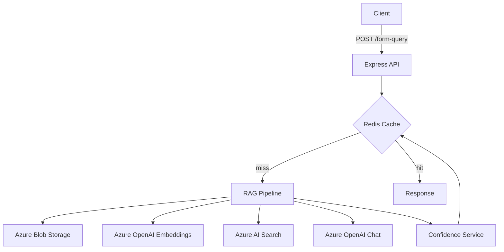

# Azure RAG Backend

Production-grade Retrieval-Augmented Generation (RAG) system using Azure OpenAI, AI Search, Redis, and Blob Storage. Hybrid vector + lexical search with multi-signal confidence scoring. Built with Node.js, TypeScript, Express. Fully tested, type-safe, and Azure-optimized.

## Architecture


*Hybrid RAG pipeline with caching, vector search, and confidence scoring*

## Quickstart

### Local Development

```bash
# Clone and install
git clone <repo-url>
cd azure-rag-test
npm install

# Configure environment
cp .env.local.example .env.local
# Edit .env.local with Azure credentials
# Set AZURE_MODE=true (default)

# Start Redis
docker-compose up -d

# Run dev server
npm run dev
```

Server runs on `http://localhost:3000`. Test with `curl http://localhost:3000/health`.

### Azure Deployment

```bash
# Deploy infrastructure
bash scripts/deploy-azure.sh

# Or manually:
az group create --name rg-rag-prod --location eastus
az deployment group create --resource-group rg-rag-prod --template-file infra/bicep/main.bicep
```

## Documentation

### 📚 Deep-Dive Guides (Concepts & Math)

Where to find detailed AI/RAG/LLM explanations:

- **[RAG Service](src/services/README.md)** - Pipeline flow, sequence diagrams, top-K explanation
- **[Confidence Scoring](src/services/confidence/README.md)** - Formula, calibration, concrete math examples
- **[Azure Integrations](src/lib/azure/README.md)** - OpenAI, AI Search, Redis, Blob clients
- **[Vector Store](src/lib/azure/README.md#lexical-score-explained)** - Lexical scores, BM25, hybrid search

### 🗂 Module Documentation

- **[API Layer](src/api/README.md)** - Endpoints, middleware, validation
- **[Services](src/services/README.md)** - RAG orchestration
  - [Ingest](src/services/ingest/README.md) - Data ingestion pipeline
  - [Retrieval](src/services/retrieval/README.md) - Hybrid search
  - [Generation](src/services/generation/README.md) - LLM generation
  - [Confidence](src/services/confidence/README.md) - Scoring system
- **[Configuration](src/config/README.md)** - Env vars, feature flags
- **[Utilities](src/utils/README.md)** - Logger, tokenizer, helpers
- **[Tests](src/tests/README.md)** - Testing approach
- **[Infrastructure](infra/README.md)** - Bicep IaC templates
- **[Scripts](scripts/README.md)** - Automation tools

### 📖 Additional Resources

- **[Architecture Decision Records](doc/adr/)** - Design decisions
  - [001: Azure AI Search](doc/adr/001-azure-search.md)
  - [002: Redis Caching](doc/adr/002-redis-caching.md)
  - [003: Confidence Formula](doc/adr/003-confidence-formula.md)
- **[OpenAPI Spec](openapi.yaml)** - API schema
- **[Postman Collection](postman/)** - API testing collection

## API Endpoints

### POST /api/form-query

**Request:**
```bash
curl -X POST http://localhost:3000/api/form-query \
  -H "Content-Type: application/json" \
  -d '{"formQuestion": "What is the customer email?", "customerId": "cust-123"}'
```

**Response:**
```json
{
  "success": true,
  "data": {
    "answer": "john.doe@example.com",
    "dataPath": ["contact.email"],
    "confidence": 0.87,
    "sources": [{"dataPath": "contact.email", "score": 0.92}],
    "cached": false
  }
}
```

### POST /api/ingest

Requires `X-API-Key` header. See [API docs](src/api/README.md) for details.

### GET /health

```bash
curl http://localhost:3000/health
```

## Development

```bash
npm run dev          # Start dev server
npm run build        # Build TypeScript
npm test             # Run tests
npm run lint         # Lint code
npm run format       # Format code
```

## Environment Variables

Key variables in `.env.local`:

```bash
AZURE_OPENAI_ENDPOINT=https://your-resource.openai.azure.com/
AZURE_OPENAI_API_KEY=your-key
AZURE_OPENAI_CHAT_DEPLOYMENT=gpt-4-turbo
AZURE_OPENAI_EMBEDDING_DEPLOYMENT=text-embedding-3-large

AZURE_SEARCH_ENDPOINT=https://your-search.search.windows.net
AZURE_SEARCH_API_KEY=your-key

AZURE_REDIS_HOST=your-redis.redis.cache.windows.net
AZURE_REDIS_PASSWORD=your-password

AZURE_MODE=true  # Use Azure services (default)
```

See [.env.local.example](.env.local.example) for complete list.

## Cost Estimate

- **Dev/Test**: ~$160-200/month (Basic tiers)
- **Production**: ~$500-1000/month (Standard tiers, auto-scaling)

See [Azure Services Cost Table](README.md.backup) for breakdown.

## License

MIT

---

**Last updated**: 2026-02-01T15:50:00Z  
**Generated by**: Copilot Workspace action prompt
