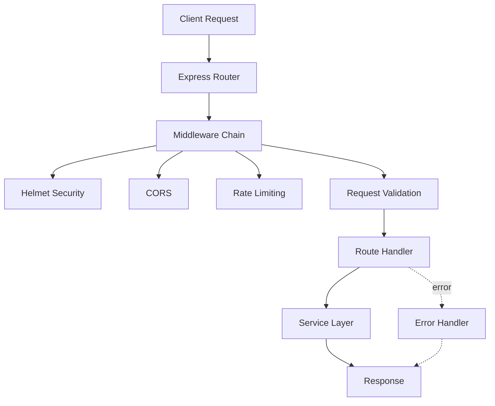
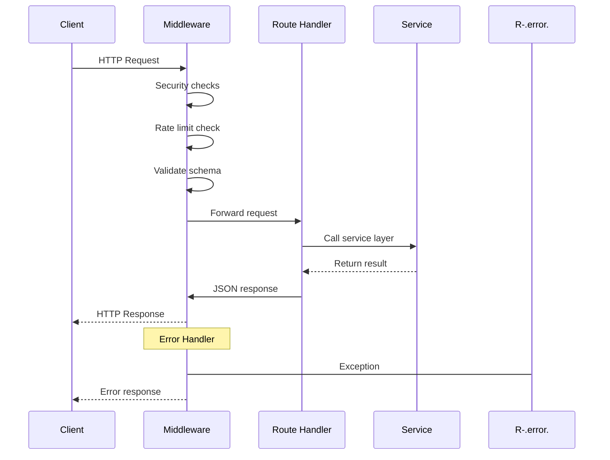

# API Layer

Express-based REST API layer providing endpoints for form queries, data ingestion, and health checks. Includes middleware for validation, error handling, rate limiting, and security.

## Architecture


*API layer architecture showing middleware pipeline*

## Request Flow


*Sequence diagram for request processing*

## Endpoints

### POST /api/form-query

Process a form question and return an AI-generated answer with confidence score.

**Request**:
```bash
curl -X POST http://localhost:3000/api/form-query \
  -H "Content-Type: application/json" \
  -d '{
    "formQuestion": "What is the customer email?",
    "customerId": "cust-123"
  }'
```

**Response**:
```json
{
  "success": true,
  "data": {
    "answer": "john.doe@example.com",
    "dataPath": ["contact.email"],
    "confidence": 0.87,
    "sources": [{"dataPath": "contact.email", "score": 0.92}],
    "cached": false
  }
}
```

### POST /api/ingest

Ingest customer data into search index (requires API key authentication).

**Request**:
```bash
curl -X POST http://localhost:3000/api/ingest \
  -H "Content-Type: application/json" \
  -H "X-API-Key: your-secret-key" \
  -d '{
    "customerId": "cust-123",
    "forceReindex": false
  }'
```

**Response**:
```json
{
  "success": true,
  "data": {
    "customerId": "cust-123",
    "documentsProcessed": 45,
    "chunksCreated": 120,
    "success": true
  }
}
```

### GET /health

Health check endpoint for monitoring.

**Request**:
```bash
curl http://localhost:3000/health
```

**Response**:
```json
{
  "status": "ok",
  "timestamp": "2026-02-01T15:35:00.000Z",
  "services": {
    "redis": "ok",
    "search": "ok"
  }
}
```

## File Pointers

- **Main app**: `src/api/app.ts` - Express app setup and middleware
- **Routes**: `src/api/routes.ts` - Route aggregation
- **Form query**: `src/api/formQuery.ts` - POST /form-query handler
- **Ingest**: `src/api/ingest.ts` - POST /ingest handler
- **Health**: `src/api/health.ts` - GET /health handler
- **Middleware**: `src/api/middleware.ts` - Validation, error handling, auth

## Where to Start

1. **Read**: `app.ts` for Express setup and middleware chain
2. **Explore**: `routes.ts` to see all registered routes
3. **Trace**: Pick an endpoint (e.g., `formQuery.ts`) and follow the flow

## What to Change

1. **Rate limits**: Edit `app.ts` → `rateLimit` config (default: 100 req/min)
2. **Validation rules**: Modify Joi schemas in each route file
3. **CORS origins**: Update `cors` config in `app.ts`

## Example Integration

```typescript
import express from 'express';
import { createApp } from './api/app';

const app = createApp();
const port = 3000;

app.listen(port, () => {
  console.log(`API server listening on port ${port}`);
});
```

## Troubleshooting

### 429 Too Many Requests
- **Check**: Rate limit configuration in `app.ts`
- **Verify**: Client isn't sending excessive requests
- **Action**: Increase `windowMs` or `max` in rate limit config

### 400 Validation Error
- **Check**: Request body matches Joi schema
- **Verify**: Required fields are present and correct type
- **Action**: Review error message for specific field validation failure

### 401 Unauthorized (ingest endpoint)
- **Check**: `X-API-Key` header is present
- **Verify**: API key matches `INGEST_API_KEY` in `.env.local`
- **Action**: Generate and use correct API key from environment

---

**Last updated**: 2026-02-01T15:35:00Z  
**Author**: Generated by Copilot action prompt; review recommended
