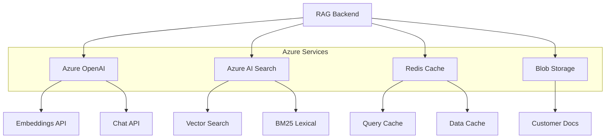
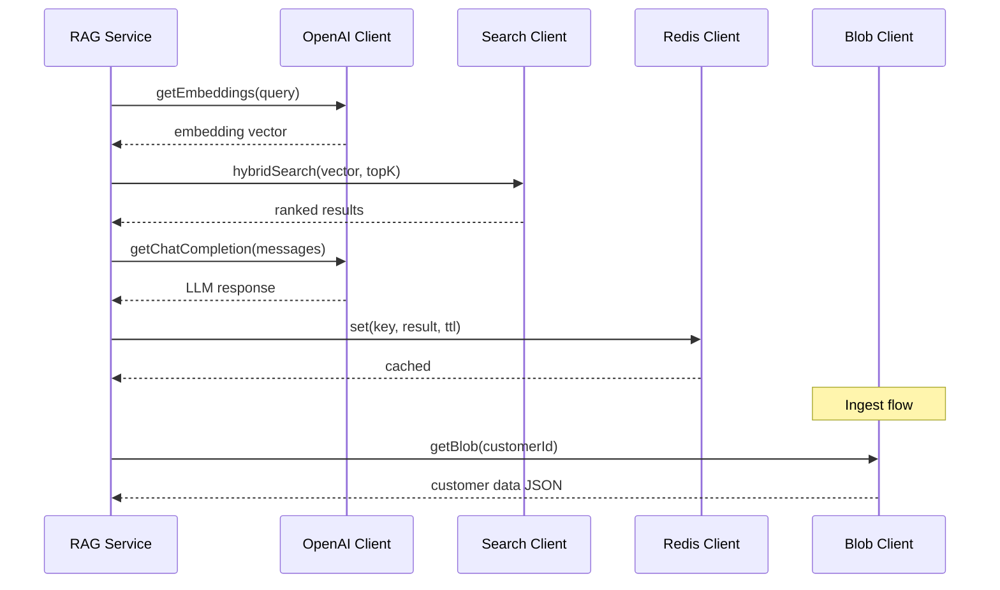

# Azure Service Integrations

Wrapper clients for all Azure services used in the RAG backend: Azure OpenAI (embeddings + chat), Azure AI Search (vector store), Azure Cache for Redis (caching), and Azure Blob Storage (document storage).

## Architecture


*Azure service integration architecture*

## Service Integration Flow


*Sequence showing Azure service orchestration in RAG pipeline*

## Azure OpenAI Client

### Embeddings

**Purpose**: Convert text into semantic vector representations for similarity search.

**Behavior**: 
- Uses `text-embedding-3-large` model (3072 dimensions)
- Batches multiple texts in single API call for efficiency
- Returns normalized vectors suitable for cosine similarity

**Example**:
```typescript
const embeddings = await openaiClient.getEmbeddings([
  'What is the customer email?',
  'Contact information'
]);
// Returns: [[0.123, -0.456, ...], [0.789, ...]] (3072 dims each)
```

### Chat Completions

**Purpose**: Generate natural language answers using GPT-4 with provided context.

**Behavior**:
- Uses `gpt-4-1106-preview` (or configured deployment)
- Supports structured JSON responses via function calling
- Returns token usage for cost tracking

**Example**:
```typescript
const response = await openaiClient.getChatCompletion([
  { role: 'system', content: 'You are a helpful assistant.' },
  { role: 'user', content: 'What is the email?' }
]);
// response.content: "The email is john@example.com"
// response.usage: { promptTokens: 45, completionTokens: 12 }
```

### Function Signatures

```typescript
class AzureOpenAIService {
  // Generate embeddings
  async getEmbeddings(text: string | string[]): Promise<number[][]>
  
  // Chat completion
  async getChatCompletion(messages: Message[]): Promise<{
    content: string;
    usage?: TokenUsage;
  }>
  
  // Structured JSON response
  async getStructuredCompletion<T>(messages: Message[]): Promise<T>
}
```

## Azure AI Search (Vector Store)

### Vector Search Behavior

**Purpose**: Hybrid semantic + lexical search combining vector similarity and BM25.

**Similarity Reporting**: 
- **Vector similarity**: Cosine distance (0-1, higher is better)
- **Lexical score**: BM25 relevance (0-100+ range, Azure-specific scaling)

**vs Other Stores**: 
- **Azure**: Reports both similarity and BM25 as separate scores
- **Pinecone**: Single combined score
- **Weaviate**: Separate distance metric (lower is better)

**Example**:
```typescript
const results = await searchClient.hybridSearch({
  vector: queryEmbedding,
  topK: 5,
  filter: "customerId eq 'cust-123'"
});

results[0].score;         // 0.92 (cosine similarity)
results[0].rerankerScore; // 45.2 (BM25 lexical)
```

### Function Signatures

```typescript
class AzureSearchService {
  // Ensure index exists, create if not
  async ensureIndex(): Promise<void>
  
  // Hybrid vector + BM25 search
  async hybridSearch(options: VectorSearchOptions): Promise<SearchResult[]>
  
  // Index documents with embeddings
  async indexDocuments(documents: SearchDocument[]): Promise<void>
  
  // Delete documents by filter
  async deleteDocuments(filter: string): Promise<void>
}
```

## Redis Cache Client

**Purpose**: High-performance caching for query results and customer data.

**Behavior**:
- Supports both query cache (1 hour TTL) and data cache (24 hour TTL)
- JSON serialization/deserialization built-in
- Connection pooling and retry logic
- TLS encryption for Azure Redis

**Example**:
```typescript
const redisClient = getRedisClient();

// Cache query result
await redisClient.set('query:hash123', result, 3600); // 1 hour

// Retrieve from cache
const cached = await redisClient.get<QueryResult>('query:hash123');

// Check existence
const exists = await redisClient.exists('customer:cust-123:indexed');
```

### Function Signatures

```typescript
class RedisService {
  // Set value with TTL (seconds)
  async set<T>(key: string, value: T, ttl?: number): Promise<void>
  
  // Get value with type safety
  async get<T>(key: string): Promise<T | null>
  
  // Check if key exists
  async exists(key: string): Promise<boolean>
  
  // Delete key
  async delete(key: string): Promise<void>
  
  // Test connection
  async ping(): Promise<boolean>
}
```

## Blob Storage Client

**Purpose**: Store and retrieve customer documents from Azure Blob Storage.

**Behavior**:
- Reads customer data as JSON from blob containers
- Supports streaming for large files
- Container auto-creation
- SAS token support for secure access

**Example**:
```typescript
const blobClient = getBlobClient();

// Get customer data
const customerData = await blobClient.getCustomerData('cust-123');
// Returns: { contact: { email: "...", phone: "..." }, ... }

// Upload data (less common - typically done externally)
await blobClient.uploadBlob('customer-data', 'cust-456.json', jsonData);
```

### Function Signatures

```typescript
class AzureBlobService {
  // Retrieve customer JSON data
  async getCustomerData(customerId: string): Promise<Record<string, unknown>>
  
  // Upload blob
  async uploadBlob(container: string, blobName: string, data: Buffer | string): Promise<void>
  
  // Check if blob exists
  async blobExists(container: string, blobName: string): Promise<boolean>
}
```

## Lexical Score Explained

**Lexical scores** measure literal text overlap and term-frequency-based relevance using algorithms like BM25 (Best Match 25). Unlike vector similarity which captures semantic meaning, lexical scoring focuses on exact keyword matches and term importance.

**How it works**:
- Analyzes term frequency (TF) in the document
- Considers inverse document frequency (IDF) for rare terms
- Adjusts for document length normalization
- Produces scores typically in range 0-100 for Azure AI Search

**Complementary to vector similarity**:
- **Vector**: "customer email" matches "contact information" (semantic)
- **Lexical**: "customer email" matches exact phrase "customer email" (literal)

Together, they provide robust retrieval: semantic understanding + keyword precision.

## Index Field Schema

```typescript
interface SearchDocument {
  id: string;                    // Unique document ID
  content: string;               // Text content of chunk
  contentVector: number[];       // Embedding (3072 dimensions)
  dataPath: string;              // JSON path (e.g., "contact.email")
  customerId: string;            // Customer identifier
  chunkIndex: number;            // Chunk position in document
  metadata: {
    documentId: string;
    source: string;
  };
}
```

### Vector Configuration

- **Dimensions**: 3072 (text-embedding-3-large)
- **Similarity**: Cosine
- **Algorithm**: HNSW (Hierarchical Navigable Small World)
- **Parameters**: 
  - m: 4 (connections per layer)
  - efConstruction: 400
  - efSearch: 500

## Search Response Example

```typescript
const results = await searchClient.hybridSearch({
  vector: queryEmbedding,
  topK: 5,
  filter: "customerId eq 'cust-123'"
});

// results: SearchResult[]
[
  {
    id: 'doc1-chunk0',
    content: 'Customer email: john.doe@example.com',
    dataPath: 'contact.email',
    customerId: 'cust-123',
    score: 0.92,              // Vector similarity (cosine)
    rerankerScore: 45.2       // BM25 lexical score
  },
  {
    id: 'doc1-chunk1',
    content: 'Phone number: 555-1234',
    dataPath: 'contact.phone',
    customerId: 'cust-123',
    score: 0.78,
    rerankerScore: 38.1
  }
]
```

**Field Mapping**:
- `score`: Vector similarity (0-1, cosine distance)
- `rerankerScore`: Lexical/BM25 score (0-100 range)
- `dataPath`: JSON path to source data
- `chunkIndex`: Position in original document

## Top-K Tradeoffs

**K** controls how many results to retrieve from the index.

### Small K (e.g., K=3)
- ✅ Faster search
- ✅ Lower cost (fewer embeddings to compute for re-ranking)
- ✅ Less noise in LLM context
- ❌ May miss relevant chunks (lower recall)

### Large K (e.g., K=10)
- ✅ Higher recall (more likely to find all relevant info)
- ✅ Better for complex queries spanning multiple chunks
- ❌ Slower search
- ❌ More tokens in LLM context (higher cost)
- ❌ More noise if results aren't all relevant

### Re-ranking

After hybrid search returns top-K results, the system can:
1. **Re-score** using cross-encoder models (not currently implemented)
2. **Filter** by confidence threshold
3. **Deduplicate** by dataPath

Default K=5 balances recall and cost. See [RAG service README](../../services/README.md) for tuning guidance.

## File Pointers

- **OpenAI client**: `src/lib/azure/openaiClient.ts` - Chat and embeddings
- **Search client**: `src/lib/azure/searchClient.ts` - Vector + hybrid search
- **Redis client**: `src/lib/azure/redisClient.ts` - Caching layer
- **Blob client**: `src/lib/azure/blobClient.ts` - Document storage
- **Index file**: `src/lib/azure/index.ts` - Exports all clients
- **Config**: `src/config/env.ts` - Azure endpoints and credentials

## Where to Start

1. **Read**: `index.ts` for singleton client initialization
2. **Explore**: `openaiClient.ts` for embedding/chat wrappers
3. **Understand**: `searchClient.ts` for hybrid search implementation

## What to Change

1. **Model deployments**: Update deployment names in `.env.local`
2. **Cache TTLs**: Modify in `redisClient.ts` set() calls
3. **Search parameters**: Tune HNSW config in `searchClient.ts` createIndex()

## Example Usage

```typescript
import { 
  getOpenAIClient,
  getSearchClient,
  getRedisClient,
  getBlobClient
} from './lib/azure';

// Initialize clients (singleton pattern)
const openai = getOpenAIClient();
const search = getSearchClient();
const redis = getRedisClient();
const blob = getBlobClient();

// Full RAG flow
const customerData = await blob.getCustomerData('cust-123');
const embedding = await openai.getEmbeddings('query text');
const results = await search.hybridSearch({ vector: embedding[0], topK: 5 });
const answer = await openai.getChatCompletion(messages);
await redis.set('cache-key', answer, 3600);
```

## Troubleshooting

### OpenAI rate limit errors
- **Check**: TPM/RPM quotas in Azure Portal → OpenAI resource → Quotas
- **Verify**: Deployment names match `.env.local` configuration
- **Action**: Implement exponential backoff or request Azure quota increase

### Search index not found
- **Check**: Index exists in Azure Portal → AI Search resource
- **Verify**: `AZURE_SEARCH_INDEX_NAME` matches actual index name
- **Action**: Call `searchClient.ensureIndex()` to auto-create

### Redis connection timeout
- **Check**: Redis hostname, port, and password in `.env.local`
- **Verify**: Firewall rules allow connection from your IP
- **Action**: Test with `redis-cli -h <host> -p 6380 --tls -a <password> ping`

---

**Last updated**: 2026-02-01T15:33:00Z  
**Author**: Generated by Copilot action prompt; review recommended
