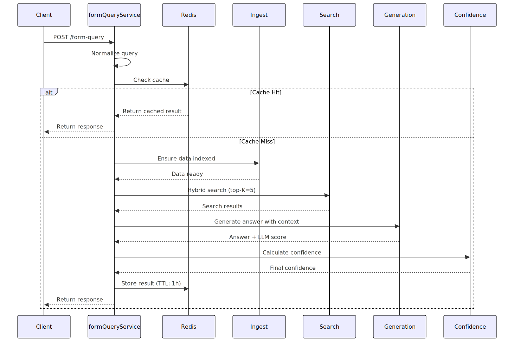

# RAG Service

<!-- MAPPED TO: src/services/ with formQueryService.ts as the main orchestrator -->

The RAG (Retrieval-Augmented Generation) service orchestrates the complete pipeline for processing form queries using hybrid vector search and LLM-based answer generation. This module combines document retrieval, confidence scoring, and answer generation into a coherent workflow.

## Architecture


*Architecture diagram showing the RAG pipeline flow from query to response*

## Query Processing Flow


*Sequence diagram for form query processing showing cache flow and pipeline steps*

## POST /form-query Flow

The main RAG endpoint processes form questions in these steps:

1. **Query Normalization** - Lowercase, trim, hash for cache key
2. **Cache Check** - Redis lookup using normalized query + customerId
3. **Data Ingestion** (if needed) - Fetch customer data from Blob Storage, chunk, embed, and index
4. **Hybrid Search** - Vector similarity + BM25 lexical search (K=5 by default)
5. **Answer Generation** - LLM generates structured JSON response with answer, data paths, and self-score
6. **Confidence Calculation** - Weighted combination: 45% similarity + 35% lexical + 20% LLM
7. **Cache & Return** - Store result in Redis (1-hour TTL), return to client

### K Parameter (top-K)

**K** is how many top candidate chunks we retrieve from the search index. Larger K increases recall (finding relevant info) but costs more and may introduce noise. Default: **K=5**.

Example: K=5 retrieves the 5 most relevant document chunks based on hybrid scoring.

## Request/Response Example

**Request:**
```bash
curl -X POST http://localhost:3000/api/form-query \
  -H "Content-Type: application/json" \
  -d '{
    "formQuestion": "What is the customer email?",
    "customerId": "cust-123"
  }'
```

**Response:**
```json
{
  "success": true,
  "data": {
    "answer": "john.doe@example.com",
    "dataPath": ["contact.email"],
    "confidence": 0.87,
    "sources": [
      {
        "dataPath": "contact.email",
        "score": 0.92
      }
    ],
    "cached": false
  }
}
```

## File Pointers

- **Main orchestrator**: `src/services/formQueryService.ts` - Complete RAG pipeline
- **Retrieval**: `src/services/retrieval/retrievalService.ts` - Hybrid search logic
- **Generation**: `src/services/generation/generationService.ts` - LLM answer generation
- **Confidence**: `src/services/confidence/confidenceService.ts` - Confidence scoring
- **Ingestion**: `src/services/ingest/ingestService.ts` - Data ingestion pipeline

## Where to Start

1. **Read**: `formQueryService.ts` for the complete RAG flow
2. **Trace**: Follow `processFormQuery()` function step-by-step
3. **Understand**: Review [confidence README](./confidence/README.md) for scoring math

## What to Change

1. **Tune K value**: Edit `config/env.ts` → `RAG_SEARCH_TOP_K` (default: 5)
2. **Adjust weights**: Modify confidence weights in `confidence/confidenceService.ts`
3. **Cache TTL**: Update `queryCache` TTL in `formQueryService.ts` (default: 3600s)

## Example Usage

```typescript
import { processFormQuery } from './services/formQueryService.js';

const result = await processFormQuery({
  formQuestion: 'What is the customer phone number?',
  customerId: 'customer-456'
});

console.log(`Answer: ${result.answer}`);
console.log(`Confidence: ${result.confidence}`);
console.log(`Data Path: ${result.dataPath.join(', ')}`);
```

## Troubleshooting

### No results returned
- **Check**: Customer data is indexed (`ingestService` logs)
- **Verify**: Query embeddings are generated correctly
- **Action**: Try with `forceReindex: true` in ingest call

### Low confidence scores
- **Check**: Search result similarity and lexical scores in logs
- **Verify**: LLM is returning self-scores in response
- **Action**: Review [confidence calibration guide](./confidence/README.md#calibration-guidance)

### Cache not working
- **Check**: Redis connection in health endpoint
- **Verify**: `FEATURE_QUERY_CACHE=true` in `.env.local`
- **Action**: Check Redis logs: `docker-compose logs redis`

## Additional Resources

- **Confidence Math**: See [services/confidence/README.md](./confidence/README.md) for detailed scoring formulas
- **Vector Store**: See [lib/azure/README.md](../lib/azure/README.md) for Azure AI Search details
- **API Docs**: See [api/README.md](../api/README.md) for endpoint specifications

---

**Last updated**: 2026-02-01T15:30:00Z
