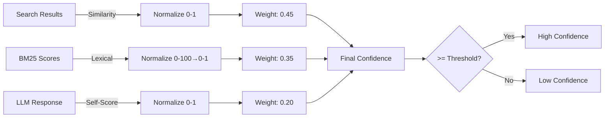
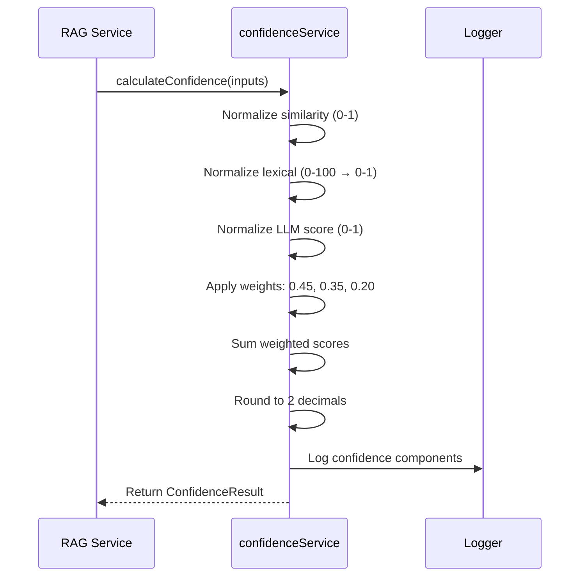

# Confidence Service

Multi-signal confidence scoring system that combines vector similarity, lexical relevance (BM25), and LLM self-assessment to produce a final confidence score for RAG answers.

## Architecture


*Confidence calculation architecture showing weighted signal combination*

## Confidence Calculation Flow


*Sequence diagram showing confidence calculation steps*

## Signal Definitions

### 1. Similarity Score (sim_score)

**Definition**: Cosine similarity between query embedding and document chunk embedding from vector search. Measures semantic similarity in high-dimensional vector space.

**Range**: 0.0 to 1.0 (Azure AI Search cosine similarity)

**Example**: 
- Query: "customer email address"
- Top result chunk: "Contact information: email john@example.com"
- Similarity: 0.92 (high semantic match)

### 2. Lexical Score (lexical_score)

**Definition**: BM25 (Best Match 25) relevance score measuring literal text overlap and term frequency. Captures exact keyword matches and term importance.

**Range**: 0 to ~100 (Azure AI Search BM25 scoring)

**Example**:
- Query: "customer email"
- Chunk contains: "customer email: john@example.com"
- Lexical: 45.2 (strong keyword overlap)

### 3. LLM Score (llm_score)

**Definition**: LLM's self-reported confidence in its generated answer. The model assesses how well it could answer based on provided context.

**Range**: 0.0 to 1.0

**Example**:
- Query: "What is the email?"
- Context provides clear email field
- LLM Score: 0.95 (very confident)

## Confidence Formula

```typescript
final_confidence = 
  0.45 × normalized_similarity +
  0.35 × normalized_lexical +
  0.20 × normalized_llm
```

### Weights Rationale

- **Similarity (45%)**: Primary signal - semantic understanding is most important
- **Lexical (35%)**: Secondary signal - keyword matching validates semantic relevance
- **LLM (20%)**: Tertiary signal - model confidence can be overconfident, so lower weight

## Concrete Example

**Scenario**: Query "What is the customer's phone number?"

**Inputs**:
- `avgSimilarityScore`: 0.89 (from top-3 search results)
- `avgLexicalScore`: 38.5 (BM25 from Azure Search)
- `llmScore`: 0.92 (LLM self-assessment)

**Step-by-Step Calculation**:

1. **Normalize similarity**: `0.89` (already 0-1) → `0.89`
2. **Normalize lexical**: `38.5 / 100` → `0.385`
3. **Normalize LLM**: `0.92` (already 0-1) → `0.92`

4. **Apply weights**:
   - Similarity component: `0.45 × 0.89 = 0.4005`
   - Lexical component: `0.35 × 0.385 = 0.13475`
   - LLM component: `0.20 × 0.92 = 0.184`

5. **Sum**: `0.4005 + 0.13475 + 0.184 = 0.71925`

6. **Round**: `0.72`

**Final Confidence**: `0.72` (72%)

## Calibration Guidance

### A/B Testing Approach

1. **Collect labeled dataset**: 100-200 queries with ground truth answers
2. **Run experiments**: Test different weight combinations
3. **Measure accuracy**: Compare predicted confidence vs actual correctness
4. **Optimize weights**: Find weights that best correlate confidence with accuracy

### Example Experiment

```typescript
// Test configurations
const configs = [
  { sim: 0.45, lex: 0.35, llm: 0.20 }, // Default
  { sim: 0.50, lex: 0.30, llm: 0.20 }, // More similarity weight
  { sim: 0.40, lex: 0.40, llm: 0.20 }, // Balanced sim/lex
];

// Evaluate each config
for (const config of configs) {
  const accuracy = evaluateOnDataset(labeledData, config);
  console.log(`Config ${JSON.stringify(config)}: ${accuracy}%`);
}
```

### Small Labeled Dataset

Create a CSV with:
- `query`: User question
- `customerId`: Customer identifier  
- `expected_answer`: Ground truth
- `is_correct`: Boolean (did RAG answer correctly?)

Run calibration to find optimal weights.

## Unit Test Example

```typescript
import { calculateConfidence } from './confidenceService';

describe('Confidence Calculation', () => {
  it('should calculate weighted confidence correctly', () => {
    const result = calculateConfidence({
      avgSimilarityScore: 0.89,
      avgLexicalScore: 38.5,
      llmScore: 0.92,
    });

    // Expected: 0.45*0.89 + 0.35*0.385 + 0.20*0.92 = 0.72
    expect(result.finalConfidence).toBeCloseTo(0.72, 2);
    expect(result.components.similarity).toBeCloseTo(0.89, 2);
    expect(result.components.lexical).toBeCloseTo(0.39, 2);
    expect(result.components.llm).toBeCloseTo(0.92, 2);
    expect(result.weights).toEqual({
      similarity: 0.45,
      lexical: 0.35,
      llm: 0.2,
    });
  });
});
```

## File Pointers

- **Main logic**: `src/services/confidence/confidenceService.ts`
- **Tests**: `src/tests/confidence.test.ts`
- **Config**: `src/config/env.ts` (confidence threshold)

## Where to Start

1. **Read**: `calculateConfidence()` function in `confidenceService.ts`
2. **Run tests**: `npm test confidence.test.ts`
3. **Experiment**: Modify weights and observe impact

## What to Change

1. **Weights**: Edit `CONFIDENCE_WEIGHTS` in `confidenceService.ts`
2. **Threshold**: Update `RAG_CONFIDENCE_THRESHOLD` in `config/env.ts` (default: 0.6)
3. **Normalization**: Adjust ranges in `normalizeScore()` if using different search backend

## Example Usage

```typescript
import { calculateConfidence, meetsConfidenceThreshold } from './services/confidence';

const confidenceResult = calculateConfidence({
  avgSimilarityScore: 0.85,
  avgLexicalScore: 42.0,
  llmScore: 0.88,
});

console.log(`Final Confidence: ${confidenceResult.finalConfidence}`);
console.log(`Components:`, confidenceResult.components);

if (meetsConfidenceThreshold(confidenceResult.finalConfidence)) {
  console.log('High confidence answer!');
}
```

## Troubleshooting

### Confidence always too low
- **Check**: Search result scores in logs - may be genuinely poor matches
- **Verify**: LLM is returning self-scores in JSON response
- **Action**: Review sample queries and expected scores, adjust weights if needed

### Confidence too high for wrong answers
- **Check**: Weights may over-rely on LLM score (reduce from 0.20)
- **Verify**: Search results are actually relevant (inspect `dataPath`)
- **Action**: Increase lexical weight to validate semantic matches

### Inconsistent confidence ranges
- **Check**: Normalization ranges match your search backend (Azure = 0-1 sim, 0-100 lexical)
- **Verify**: All three scores are being computed correctly
- **Action**: Add debug logging for raw and normalized scores

---

**Last updated**: 2026-02-01T15:31:00Z  
**Author**: Generated by Copilot action prompt; review recommended
