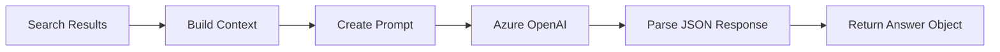
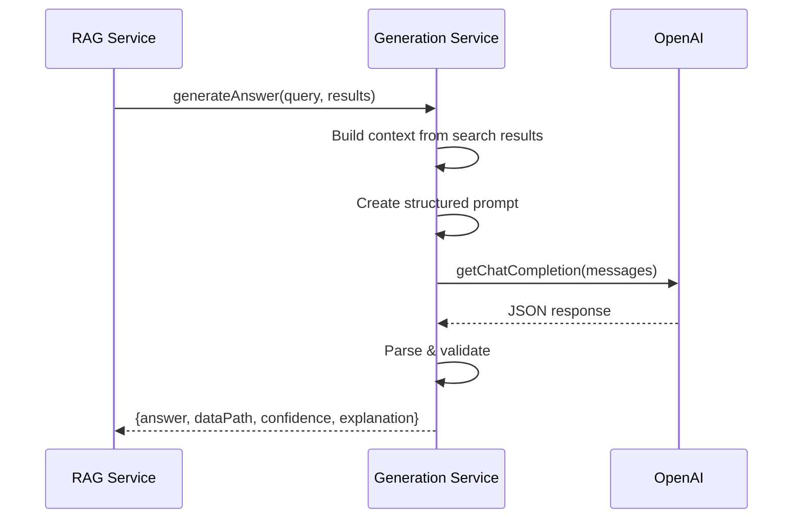

# Generation Service

LLM-based answer generation service that uses Azure OpenAI to produce structured JSON responses with answers, data paths, explanations, and self-confidence scores.

## Architecture



## Generation Flow



## Prompt Structure

```typescript
const systemPrompt = `You are a precise data extraction assistant.
Extract the answer from the provided context.
Return JSON: { answer, dataPath, confidence, explanation }`;

const userPrompt = `Question: ${query}
Context: ${searchResults}`;
```

## Response Format

```json
{
  "answer": "john.doe@example.com",
  "dataPath": ["contact.email"],
  "confidence": 0.95,
  "explanation": "Found exact email field in contact information"
}
```

## File Pointers

- **Service**: `src/services/generation/generationService.ts`
- **API caller**: Uses `lib/azure/openaiClient.ts`

## Example Usage

```typescript
import { generateAnswer } from './services/generation';

const result = await generateAnswer({
  query: 'What is the customer phone?',
  searchResults: retrievedChunks
});

console.log(result.answer); // "555-1234"
```

---

**Last updated**: 2026-02-01T15:42:00Z  
**Author**: Generated by Copilot action prompt; review recommended
