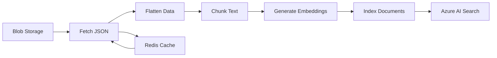
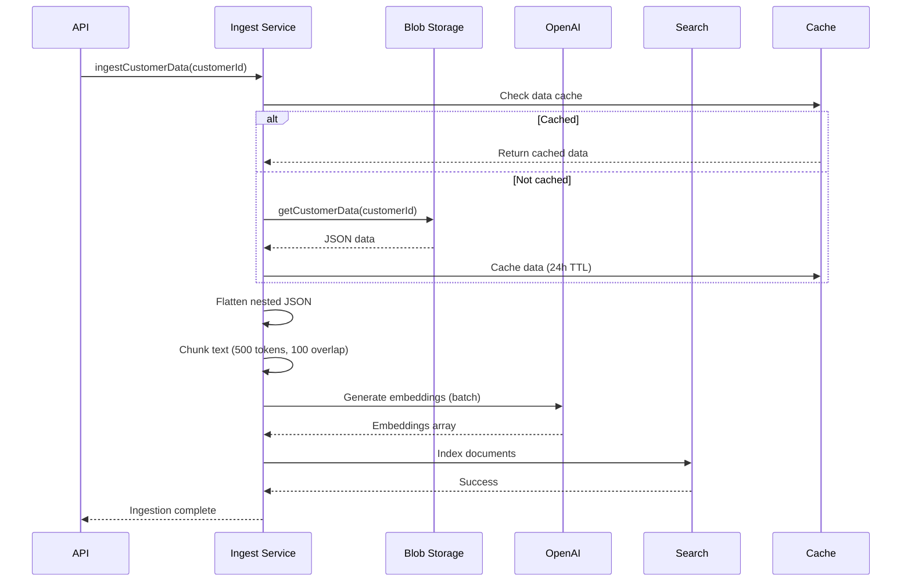

# Ingest Service

Document ingestion pipeline that fetches customer data from Azure Blob Storage, chunks it, generates embeddings, and indexes it in Azure AI Search for retrieval.

## Architecture


*Ingest pipeline flow from blob storage to search index*

## Ingestion Flow


*Sequence diagram showing data ingestion pipeline*

## Processing Steps

1. **Fetch Data** - Retrieve customer JSON from Blob Storage or cache
2. **Flatten** - Convert nested objects to flat key-value pairs (e.g., `contact.email`)
3. **Chunk** - Split text into 500-token chunks with 100-token overlap
4. **Embed** - Generate 3072-dim vectors via Azure OpenAI embeddings
5. **Index** - Upload documents with vectors to Azure AI Search
6. **Cache** - Store in Redis for 24 hours

## Request Example

```bash
curl -X POST http://localhost:3000/api/ingest \
  -H "Content-Type: application/json" \
  -H "X-API-Key: your-secret-key" \
  -d '{
    "customerId": "customer-123",
    "forceReindex": false
  }'
```

## File Pointers

- **Main service**: `src/services/ingest/ingestService.ts`
- **API endpoint**: `src/api/ingest.ts`
- **Chunking logic**: Uses `src/utils/tokenizer.ts`

## Where to Start

1. **Read**: `ingestService.ts` → `ingestCustomerData()` function
2. **Understand**: Flattening logic in `flattenObject()` helper
3. **Trace**: Chunking in `chunkText()` from tokenizer

## What to Change

1. **Chunk size**: Edit `RAG_CHUNK_SIZE` in `config/env.ts` (default: 500)
2. **Overlap**: Edit `RAG_CHUNK_OVERLAP` in `config/env.ts` (default: 100)
3. **Cache TTL**: Modify `customerDataCache` TTL in `ingestService.ts` (default: 86400s)

## Example Usage

```typescript
import { ingestCustomerData } from './services/ingest';

const result = await ingestCustomerData({
  customerId: 'cust-456',
  forceReindex: false
});

console.log(`Processed: ${result.documentsProcessed} docs`);
console.log(`Created: ${result.chunksCreated} chunks`);
```

## Troubleshooting

### Blob not found error
- **Check**: Customer data exists in Blob Storage container
- **Verify**: `customerId` matches blob file name pattern
- **Action**: Upload customer data to `customer-data` container

### Embedding generation fails
- **Check**: Azure OpenAI quota and rate limits
- **Verify**: Deployment name matches `AZURE_OPENAI_EMBEDDING_DEPLOYMENT`
- **Action**: Retry with exponential backoff or reduce batch size

### Index operation timeout
- **Check**: Azure AI Search service health
- **Verify**: Chunk count isn't excessively large (>1000 chunks)
- **Action**: Batch index operations or increase timeout

---

**Last updated**: 2026-02-01T15:36:00Z  
**Author**: Generated by Copilot action prompt; review recommended
