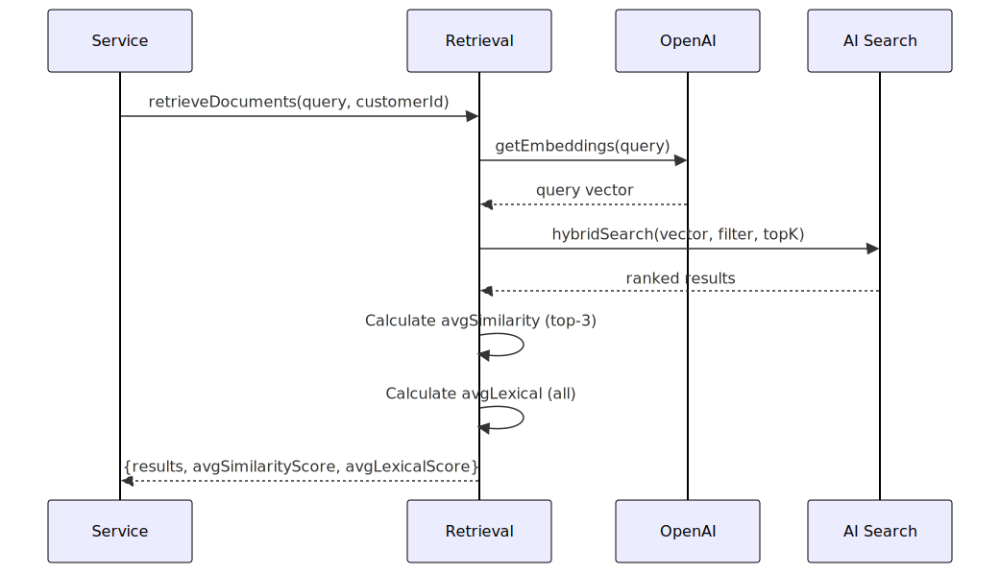

# Retrieval Service

Hybrid search service combining vector similarity and BM25 lexical scoring to retrieve relevant document chunks from Azure AI Search.

## Architecture


## Retrieval Flow



## Hybrid Search

Combines two scoring mechanisms:
- **Vector similarity**: Cosine similarity in 3072-dim space
- **BM25 lexical**: Keyword-based relevance

Results are merged and ranked by Azure AI Search.

## File Pointers

- **Service**: `src/services/retrieval/retrievalService.ts`
- **Uses**: `lib/azure/searchClient.ts`, `lib/azure/openaiClient.ts`

## Example Usage

```typescript
import { retrieveDocuments } from './services/retrieval';

const result = await retrieveDocuments({
  query: 'customer email address',
  customerId: 'cust-123',
  topK: 5
});

console.log(`Found ${result.results.length} results`);
console.log(`Avg similarity: ${result.avgSimilarityScore}`);
```

---

**Last updated**: 2026-02-01T15:43:00Z
